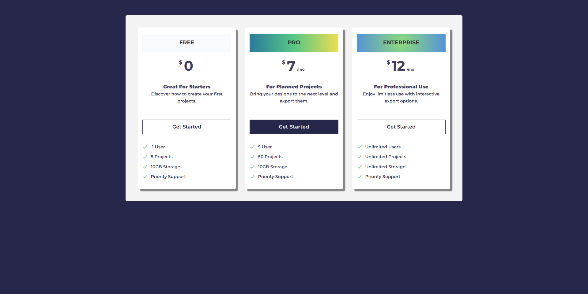

# 💳 Pricing-Cards

A clean, responsive **Pricing Page** built using **HTML** and **CSS**.  
It features three modern pricing plan cards — **Free**, **Pro**, and **Enterprise** — designed with Google Fonts and Font Awesome icons for a professional, minimalist look.

---

## 🌟 Preview


_Clean and modern responsive pricing section built with HTML and CSS._

---

## 🚀 Features

- 🧱 Simple and semantic HTML structure
- 📱 Fully responsive layout
- 🎨 Modern typography using Google Fonts
- ⚡ Crisp Font Awesome icons
- 💼 Three predefined pricing plans ready to customize

---

## 🖥️ Live Demo

[Live Demo](https://g4ieku.github.io/Pricing-Cards/)

---

## 📂 Installation & Usage

1. **Clone** the repository:
   ```bash
   git clone https://github.com/g4ieku/Pricing-Cards.git
   ```
2. Open the project folder:
   ```bash
   cd Pricing-Cards
   ```
3. Run the page locally:
   Open index.html in your preferred browser.

---

## 🧩 Customization

- Edit each pricing tier inside the `<div class="card">` elements in the HTML.
- Change fonts or colors in style.css.
- Update the “Get Started” button links with your actual URLs.
- Adjust breakpoints in CSS for your preferred responsive behavior.

---

## 💡 Use Case

Ideal for product landing pages, SaaS websites, or portfolio showcases where you want to highlight pricing tiers quickly and attractively.

---

## 🪪 License

This project is open-source and free to use for personal and commercial purposes.
Attribution is appreciated but not required.
